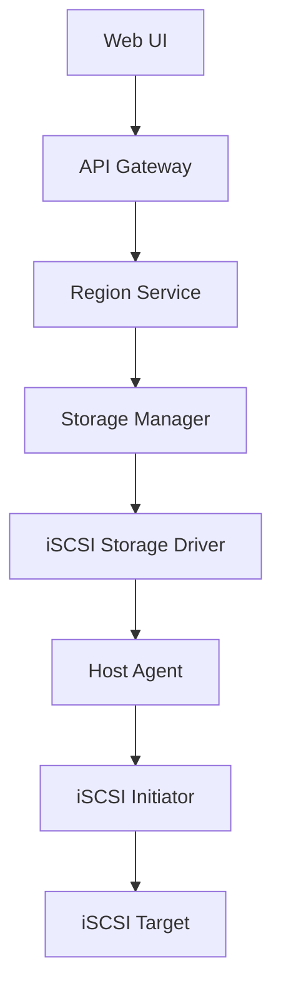

# Design Document

## Overview

本设计文档描述了如何在 CloudPods 块存储系统中新增 iSCSI 存储类型支持。iSCSI (Internet Small Computer Systems Interface) 是一种基于 IP 网络的存储协议，允许通过网络连接到远程存储设备。

通过分析现有的存储驱动架构，我们将按照现有的存储驱动模式实现 iSCSI 存储驱动，包括前端 UI 支持、API 接口扩展、存储驱动实现和主机端挂载逻辑。

## Architecture

### 系统架构概览

### 存储驱动架构

CloudPods 使用插件化的存储驱动架构，每种存储类型都有对应的驱动实现：

1. **存储驱动接口** (`IStorageDriver`) - 定义了存储驱动的标准接口
2. **基础驱动** (`SBaseStorageDriver`) - 提供通用的存储驱动功能
3. **具体驱动** (如 `SRbdStorageDriver`, `SNfsStorageDriver`) - 实现特定存储类型的逻辑
4. **驱动注册** - 通过 `RegisterStorageDriver` 注册驱动到系统中

## Components and Interfaces

### 1. API 层扩展

#### 存储类型常量定义
在 `pkg/apis/compute/storage_const.go` 中添加 iSCSI 存储类型常量

#### 存储创建输入扩展
在 `pkg/apis/compute/storage.go` 的 `StorageCreateInput` 结构中添加 iSCSI 相关字段

### 2. 存储驱动实现

#### iSCSI 存储驱动
创建 `pkg/compute/storagedrivers/iscsi.go`，实现 iSCSI 存储驱动

#### 存储配置结构
定义 iSCSI 存储配置结构

### 3. 主机端支持

#### 主机存储管理器扩展
在 `pkg/hostman/storageman` 中添加 iSCSI 存储管理器

### 4. 前端 UI 支持

#### 存储类型选择
在存储创建表单中添加 iSCSI 选项，当用户选择 iSCSI 时显示相应的配置字段

## Data Models

### 存储配置数据模型

iSCSI 存储的配置信息将存储在 `SStorage.StorageConf` 字段中，包含以下信息：
- Target 地址
- IQN (iSCSI Qualified Name)
- Portal 地址
- 认证信息（用户名/密码，可选）
- LUN ID

### 数据库模式

无需修改现有数据库模式，iSCSI 配置信息存储在现有的 `storages_tbl.storage_conf` 字段中。

## Error Handling

### 1. 配置验证错误
- 无效的 IQN 格式
- 无效的 Target 地址
- 连接失败

### 2. 运行时错误
- iSCSI 连接中断
- 认证失败
- 设备不可用

### 3. 错误恢复机制
- 自动重连
- 状态监控
- 故障转移

## Testing Strategy

### 1. 单元测试
- 配置验证测试
- IQN 格式验证
- 连接参数验证

### 2. 集成测试
- 存储创建测试
- 挂载/卸载测试
- 错误处理测试

### 3. 端到端测试
- UI 交互测试
- 存储生命周期测试
- 多主机测试

### 4. 性能测试
- 连接性能
- I/O 性能
- 并发测试

### 5. 兼容性测试
- 不同 iSCSI Target 测试
- 操作系统兼容性
- 网络环境测试